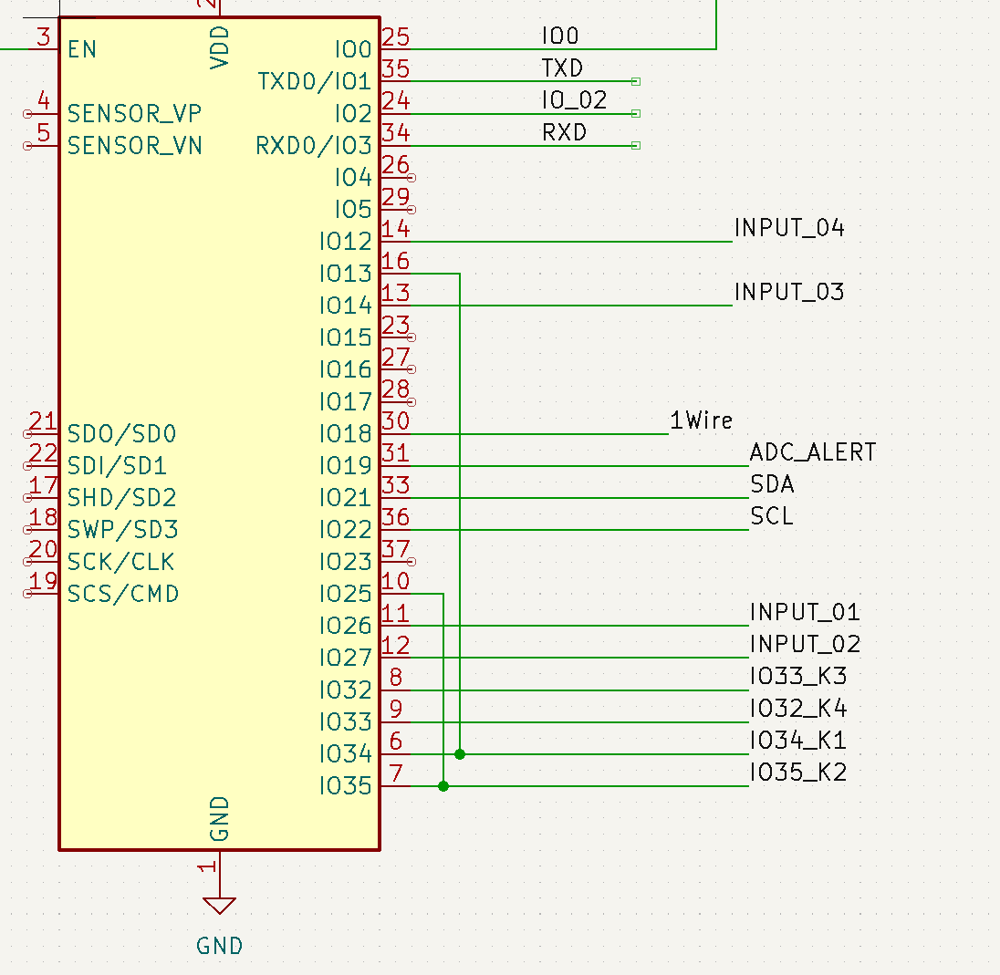

# Schaltplan

# Layout

# Bauteile

# Verdrahtungsplan

# Änderungen

Folgende Änderung muss vorgenommen werden:

IO12 kein PullUp (probleme beim booten)

IO34, IO35, IO36 and IO39 --> input only

IO34 --> IO13\
IO35 --> IO25

 
